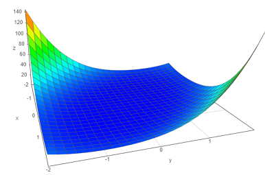

# Optimization #

**Optimization** provides various algorithms used in mathematical optimization.

* **No dependencies** except for a recent C++ and NVCC (optional) compiler
* A **custom multithreaded BLAS subset** was created to provide modular and fast execution of many linear algebra subroutines.
* Optional handcoded **GPU Acceleration** through CUDA if a recent NVIDIA graphics card is installed.

The following algorithms are currently implemented:

|Name|Description|CPU|GPU|
|---|---|---|---|
Gauss-Newton|The Gauss-Newton method minimizes objective functions in sum of squares form.|x|x|

## Installation
A build script *buildtask_msvc.cmd* is included to build the software. You can set
the *USE_CUDA=1* flag to specify if the CUDA part shall also be compiled.
This library makes use of C++ modules. It has been tested on  MSVC v16.8.4 and is assumed to work on GCC 11 (tests follow in due time). 
There are no dependencies.

## Examples
Besides the examples below, an official documentation is in the process of being created.

### Using the Gauss-Newton solver
Given is a sum of squares residual


<p align="center">

</p>

The Gauss-Newton algorithm iteratively calculates a descent direction

<p align="center">

</p>

with Jacobian
<p align="center">

</p>
Therefore, the residual and its derivatives should be designed first. Using this library, this can primarily be achieved through two means: 

#### Creating residuals and derivative through "ordinary functions"
Using ordinary functions, the residuals can be retrieved

```
template<class C, class T, class F>
void residual(C params, T storage){
	F x=*params;
	F y=*(params+1);
	*storage=a*a*x*x+a*b*x*y+b*b*y*y;
}

template<class C, class T, class F>			
void jacobian(C input, T storage){
	F x=*input;
	F y=*(input+1);
	*storage=2*a*a*x+a*b*y;
	*(storage+1)=2*b*b*y+a*b*x;
}
```
The use of templates is not required but recommended, as it allows for the use of 
different containers or numeric datatypes.

#### Creating residuals and derivative through class member functions
It might be advantageous to compartmentalize the entire problem formulation into a class. If performance is absolutely critical, only use this for problems with larger computation times (over 500 ms). The reason is that this approach necessitates two calls to an *std::function* object in each Gauss-Newton Iteration. In practice, performance drawbacks are, if at all, barely noticeable.
```
export template<class C, class T, class F>
class Convex1{
	
	private:
	F a;
	F b;
	
	public:
	Convex1(F _a, F _b):a(_a),b(_b){
	}
	void residual(C params, T storage){
		F x=*params;
		F y=*(params+1);
		*storage=a*a*x*x+a*b*x*y+b*b*y*y;
	}
				
	void jacobian(C input, T storage){
		F x=*input;
		F y=*(input+1);
		//std::cout<<x<<"\t"<<y<<"\n\n";
		*storage=2*a*a*x+a*b*y;
		*(storage+1)=2*b*b*y+a*b*x;
	}
	const int rdim=1;
	const int xdim=2;
};
```
Again, the usage of templates is recommended but not required.

The sum of squares residuals function of this example looks like this (a=b=1):



#### Starting the GNS solver (CPU Version)
Calling the Gauss-Newton solver is now very simple. This example is a little more elaborate, as the residual and Jacobian is packed into a class member function (second approach above).

```
//define the initial values
std::vector<double> x0={1.0,2.0};

//Create an instance of the problem forumlation (continuation from example above)
Convex1<std::vector<double>::const_iterator, std::vector<double>::iterator,double> c1(1,1);

//Bind residual to function object
using std::placeholders::_1;
using std::placeholders::_2;
auto f1=std::bind(&Convex1<std::vector<double>::const_iterator, std::vector<double>::iterator,double>::residual,c1,_1,_2);

//Bind Jacobian to function object
auto f2=std::bind(&Convex1<std::vector<double>::const_iterator, std::vector<double>::iterator,double>::jacobian,c1,_1,_2);

//Create an instance of the Gauss-Newton solver
opt::solvers::GNSCPU<std::vector<double>,std::function<void(std::vector<double>::const_iterator, std::vector<double>::iterator)>> gns(f1,f2,c1.xdim,c1.rdim,std::cout.rdbuf());

//Set convergence tolerance (optional)
gns.tol=0.1; //in this specific problem lower values lead to instability in calculating (J^{T}J)

//Search for minimum
auto result=gns.optimize(x0);
```
The result should look like this:


#### Starting the GNS solver (GPU Version)
The GPU version requires the usage of C style arrays. Currently, only the the *float* datatype is supported.
Just like before, this example is little more elaborate as the residual and Jacobian is again packed into a class member function as explained earlier.

```
//define the initial values
float x0[]={1,2};

//define array that saves the output
float output[2];

//Create an instance of the problem formulation
Convex1<const float*, float*,float> c(1,1);

//Bind residual to function object
using std::placeholders::_1;
using std::placeholders::_2;
	
std::function<void(const float*, float*)> f1=std::bind(&Convex1<const float*, float*,float>::residual,c,_1,_2);

//Bind Jacobian to function object
std::function<void(const float*, float*)> f2=std::bind(&Convex1<const float*, float*,float>::jacobian,c,_1,_2);
				
//Create an instance of the Gauss-Newton solver
opt::solvers::gpu::GNSGPU<std::function<void(const float*, float*)>,float> gns(f1,f2,c.xdim,c.rdim,std::cout.rdbuf());
	
//Set convergence tolerance (optional)			
gns.tol=0.1;

//Search for minimum
auto result=gns.optimize(x0,output,c.xdim);
```


#### Redefine output stream
During the iterations, the Gauss-Newton solver constantly updates the user about the current error and other information. If the solver is used within an application, it is often useful to redirect this output or silence such messages completely. This is done by providing instances of *std::streambuf* to the constructor.
```
 //This redirects messages to standard output (usually the terminal)
using opt::solvers;
GNSCPU<std::vector<double>,std::function<void(std::vector<double>::const_iterator, std::vector<double>::iterator)>> gns(f1,f2,c1.xdim,c1.rdim,std::cout.rdbuf());
```
Note that this can also be used to write information to file.
If silent operation is wanted, the buffer argument can be omitted in the constructor:
```
//This redirects messages to standard output (usually the terminal)
using opt::solvers;
GNSCPU<std::vector<double>,std::function<void(std::vector<double>::const_iterator, std::vector<double>::iterator)>> gns(f1,f2,c1.xdim,c1.rdim); 
```
This does not only mean that no messages will be printed, but none will be generated

#### Name parameters in output
If the parameters in your problem have names, you can add this information to the solver. Their current values will then be displayed as additional information during each iteration.

```
[...]
//Give parameters names
std::string parameter_names[]={"x1","x2"};

[...]
//This redirects messages to standard output (usually the terminal)
using opt::solvers;
GNSCPU<std::vector<double>,std::function<void(std::vector<double>::const_iterator, std::vector<double>::iterator)>> gns(f1,f2,c1.xdim,c1.rdim); 

//Supply name information to the solver
gns.parameter_names=parameter_names;

[...]
```

The output will now look as such:


#### Calculate additional data during each iteration
It is often useful to display additional data, such as statistics or even a complete sensitivity analysis along each iteration.
This can be easily facilitated by defining a function that will be called
asynchronously at the beginning of each iteration. To inform what information the solver is sending this function, the *opt::solvers::gns::InfoType* enum is used.

```
//This function will be called during each Gauss-Newton iteration
using opt::solvers::gns;

template<class T>
bool calculate_sensitivity(InfoType info, int n, int m, typename T::iterator A, int stride_col, int stride_row, std::streambuf* buf){
	if (info==InfoType::Jacobian){
			//Add logic to do Singular Value Decomposition (SVD)
		if (buf){
			std::ostream os(buf);
		
		}
	}
	else{
	        //Signal to the solver that the caluclation was not successful.
	        //This will not abort the estimation procedure.
			return false;
	}	
}

//Define problem et Cetera
[...]

//Create solver
using opt::solvers;
GNSCPU<std::vector<double>,std::function<void(std::vector<double>::const_iterator, std::vector<double>::iterator)>> gns(f1,f2,c1.xdim,c1.rdim); 

//Hand off sensitivity information to solver
gns.send_numerical_info=calculate_sensitivity;
```

#### Set custom tolerance level
The solver converges when 

<p align="center">

</p>

This can be set which is very useful if different parameters are in different units. If your objective function e.g. guides the design of a large piece of wood, you might not care if some parameter values are still changing a couple of centimeters every iteration, while others must be closer to convergence. A solution might be good enough at different scales. To set a different custom level from default, just override the xtol function.

```
//l2 vector norm tolerance
template<class T,class F>
bool l2_tol(int dim, T x, int stride_x, F tol){
	for (int i=0;i<dim;i++){
		float val=x[i*stride_x];
		if (val*val>tol){
			return false;
		}
	}
	return true;
}

//Define problem et Cetera
[...]

//Create solver
using opt::solvers;
GNSCPU<std::vector<double>,std::function<void(std::vector<double>::const_iterator, std::vector<double>::iterator)>> gns(f1,f2,c1.xdim,c1.rdim); 

//Hand off sensitivity information to solver
gns.xtol=l2_tol;
```
There is yet more to come!